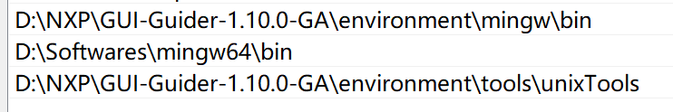

# lvgl_learn

- 安装gui

    <https://www.nxp.com.cn/design/design-center/software/development-software/gui-guider:GUI-GUIDER>

    <https://www.bilibili.com/video/BV1LU4y1q7vd/?spm_id_from=333.337.search-card.all.click&vd_source=8de5bd18bbbab43a5a69e7bf0a28a284>

- 使用方法

    在gui guider里创建工程

    在vscode里打开

    cd .\lvgl-simulator\

    mingw32-make -j8 编译

    mingw32-make clean 清除

    mingw32-make run 运行

- 报错（包括vscode和gui guider）：

    collect2.exe: error: ld returned 1 exit status
    Makefile:108: recipe for target 'default' failed
    mingw32-make: *** [default] Error 1

    解决办法：

    在系统变量path里保证gui的mingw在上层
    
